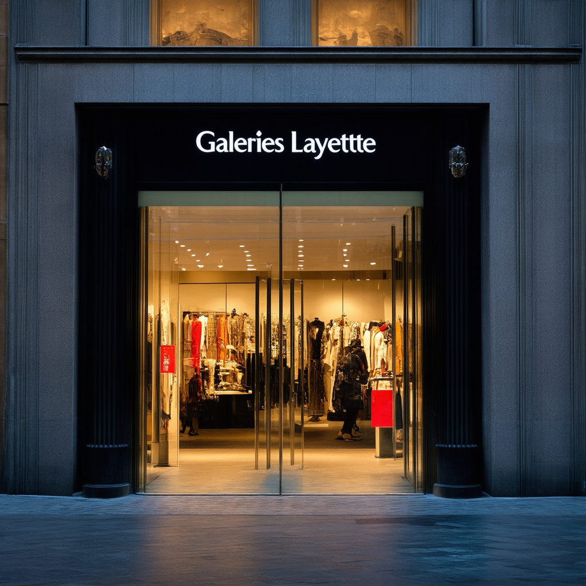
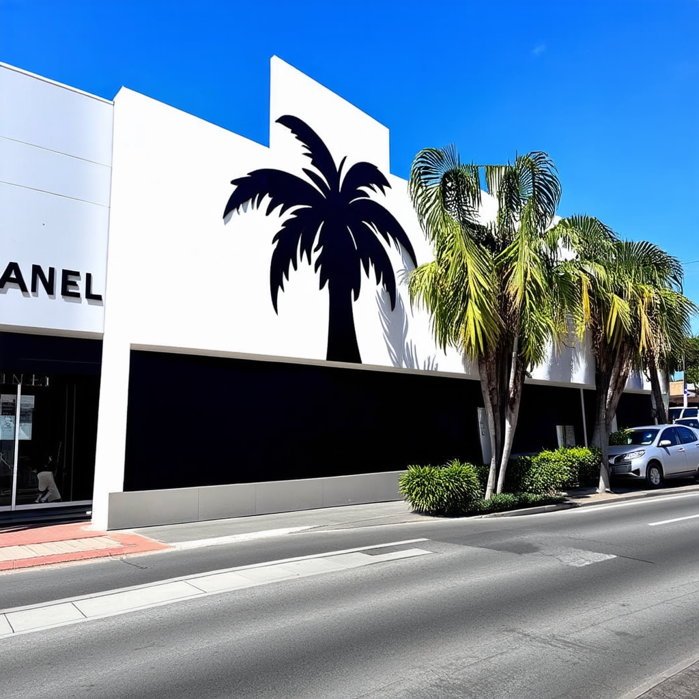
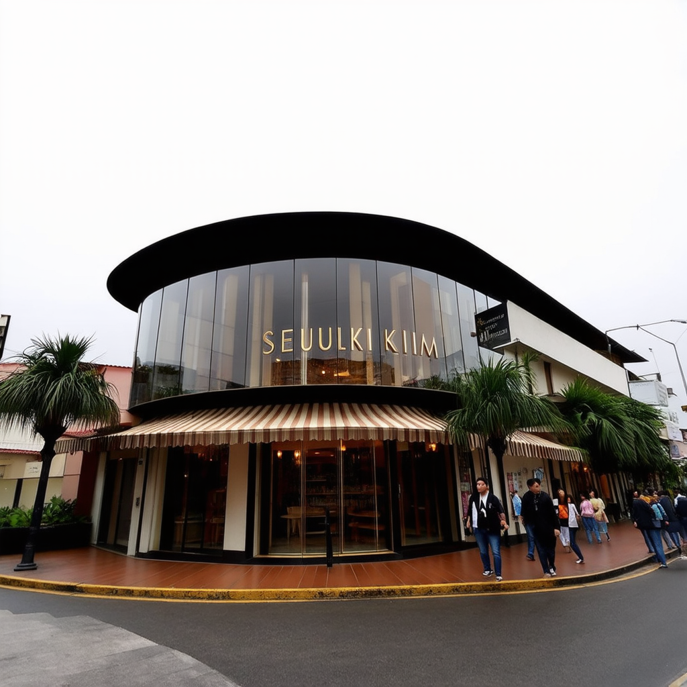
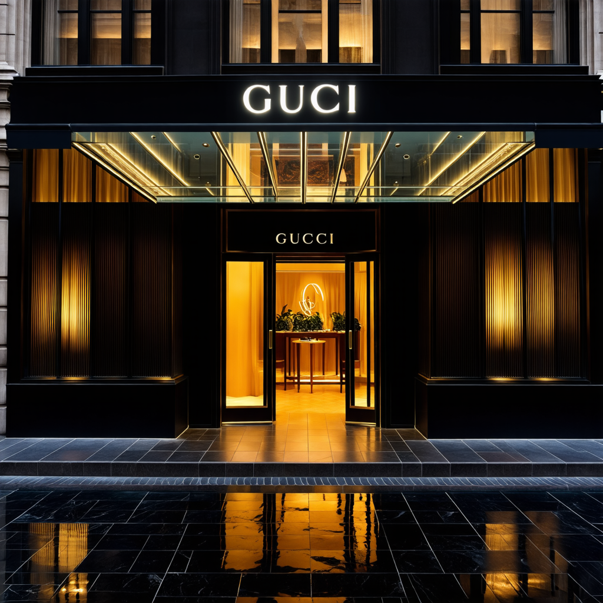
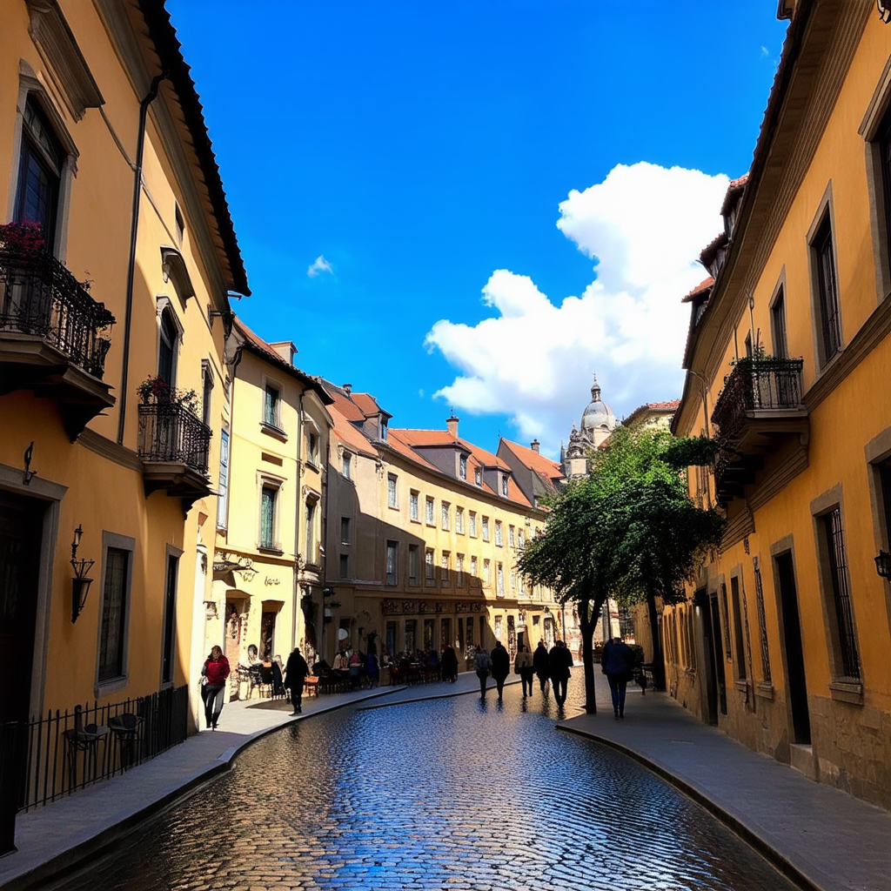
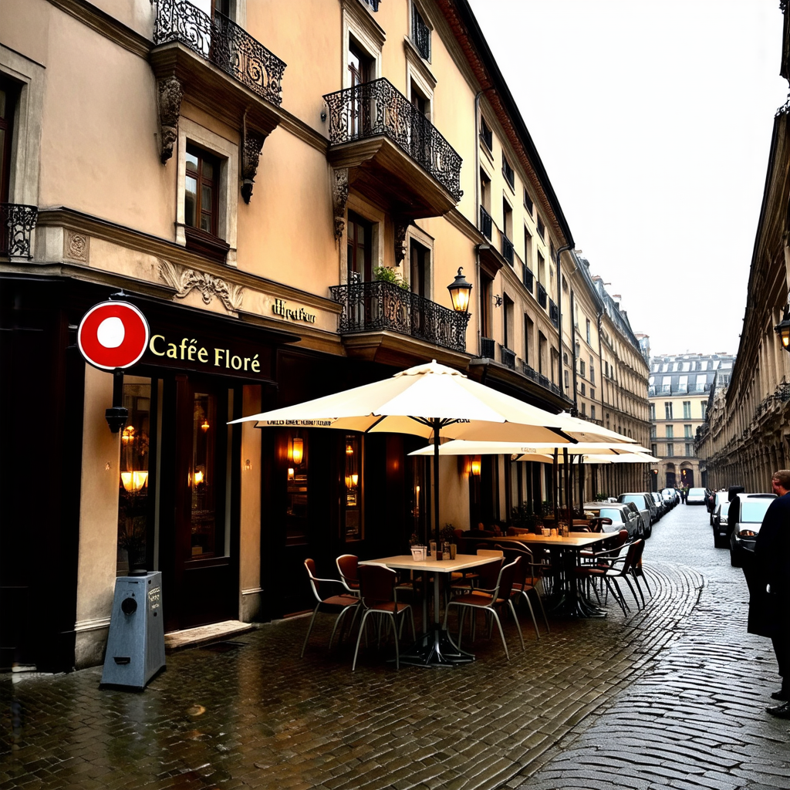
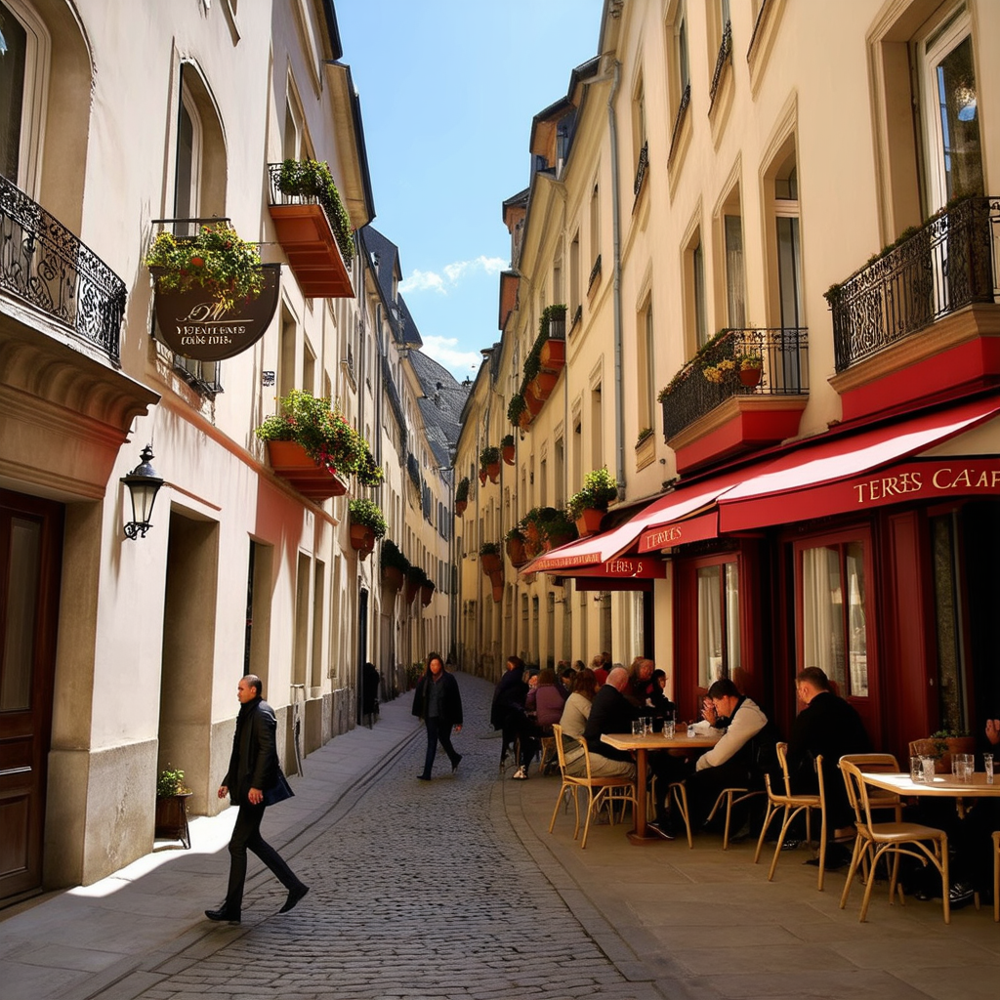

# Codingscape Vision RAG Image Generator
This application uses real life imagery to generate images that match the user's description.

## How it works
1. Find places using Google's Place API
2. Send coordinates from step 1 to Google Street view and get images from 0, 90, 180, and 270 degrees for up to 4 of the places
3. Send those images to llava to generate an overall description of the images
4. Use condensed description as a prompt to stable diffusion

## Model versions
- llava-hf/llava-v1.6-mistral-7b-hf
- stabilityai/stable-diffusion-3-medium-diffusers

# Running
## Requirements
The models are hosted at Hugging Face so you will need to get an API key from them. You will also need a Google Maps API key.

You will need approximately 32G of hard drive space to store the models.

You must have the nVidia CUDA SDK installed and the ability to run `nvcc`

## Deployment
SSH is the only supported way of running this on anything that's not local. `scp` `main.py` and `requirements.txt` to your chosen environment.

## Application
Pytorch must be installed separately due to varying hardware differences. Once that is installed, run `pip install -r requirements.txt`

Right now, it's a standalone script. There are two ways to pass your Google and Hugging Face keys. Either CLI args or ENV vars.
CLI args are `--google` and `--hf`. The ENV vars are `GOOGLE_API_KEY` and `HF_API_KEY`. You must use one of the two. Using the `--prompt` CLI arg run `python main.py`.

If you want to generate multiple images you can use the `--num` CLI arg or the `NUM_IMAGES` ENV var.

If you don't want to use `attn_implementation` with the value of "flash_attention_2", use the `--no-flash-attn` CLI arg.

You will need some pretty beefy hardware to run this on unless you have access to RunPod or GPU instances in AWS.

# Samples
> luxury goods store in Beverly Hills on Rodeo Drive

> cafe in paris france

